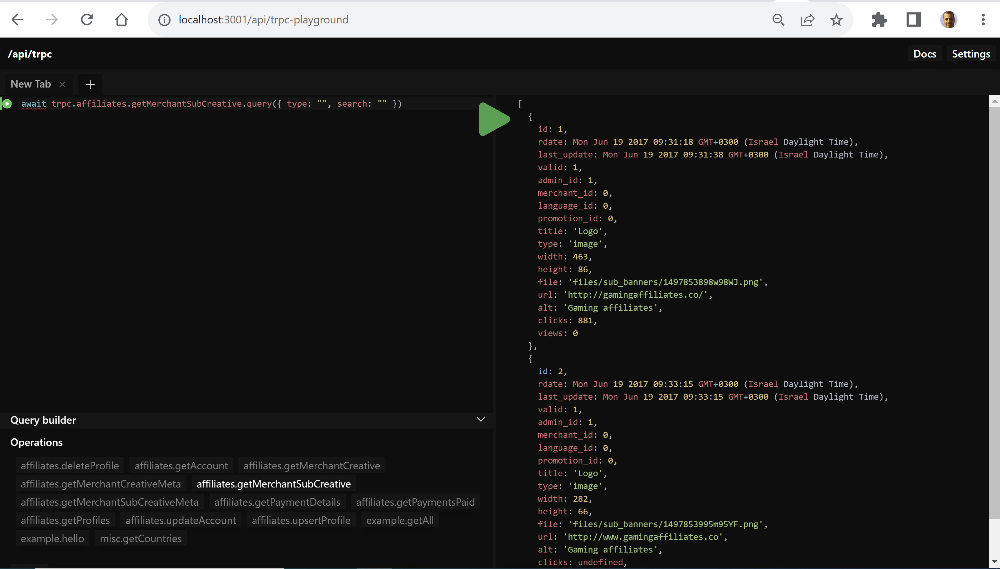

# Convert PHP Affiliate Dashboard to NodeJS

## General
We have a legacy MySQL, PHP affiliate management system we want
to convert to modern technology,

this project is to convert part of it, Affiliate dashboard
mainly the backend part, database access/API

At this stage, UI work is minimal and just to demonstrate the API, we will have a separate project to finalize the UI

### Software stack
- MySQL - Same and shard with  legacy PHP database, cannot change
- NodeJS
- Prisma - ORM
- TypeScript
- TRPC for API
- React, client side code
- Chakra-UI - Design System/Components/Theme
- Tremor

### Experience Needed
- PHP - To read existing code 
- NodeJS
- MySQL
- Prisma - Most of the work is to convert SQL queries to prisma API 
- TypeScript

### Scope
- https://affiliate-com.netlify.app/ Around 30% of the code already converted and NextJS, Prisma, TRPC, React are in place and working fine
- Need to convert other parts of the code include
  - Signup/Sign-in (`/site/signin.php`, `/site/js/login/login.js`)
  - Layout info, like username, commission 
  - Documents/Upload files
  - Main dashboard screen
  - Reports
  - Support
  - Pixel Monitor

See screenshots in the end of the document

#### NOT final UI implementation needed
Should create basic UI for the API using TRPC client and Chakra U to show and test the API 
but **NO** need for extensive styling/theme/responsive, this will be part of another project, 
see current implementation for guidelines 

### Code

Share GitHub user name and will give you access to code

#### PHP

https://github.com/affiliatets-com/FocusOption/tree/main/site/affiliate

running old system, request access

#### New, NextJS

https://github.com/affiliatets-com/aff/tree/main/app

- Prisma definition, already include relationship, may miss some
`app/prisma/schema.prisma`

- existing prisma call to query MySQL and implement TRPC API
`app/src/server/api/routers/affiliates`

- React components to show existing screens 
`app/src/components/affiliates`

**Install & Run**

```bash
yarn install
cd app
yarn dev
```

#### Playgorund for TRPC API using `http://localhost:3001/api/trpc-playground` 


## PHP System screenshots


