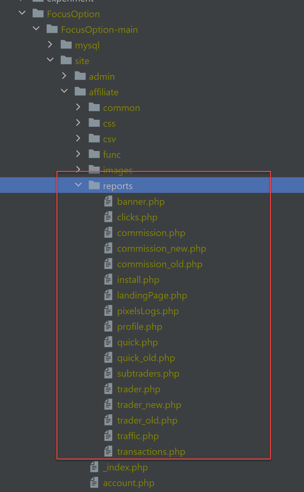

# Help Convert part of PHP App to NodeJS

## General
We have a legacy MySQL, PHP affiliate management system we want
to convert to modern technology,

this project is to convert part, few pages of it, reports

Looking for nodejs developer with MySQL/PHP that can translate to Prisma queries


### Software stack
- MySQL - Same and shard with  legacy PHP database, cannot change
- NodeJS
- Prisma - ORM
- TypeScript
- TRPC for API
- React, client side code
- Chakra-UI - Design System/Components/Theme
- Tremor

### Experience Needed
- PHP - To read existing code
- NodeJS
- MySQL
- Prisma - Most of the work is to convert SQL queries to prisma API
- TypeScript

### Scope

The main work is to convert the SQL queries from PHP code to prisma

example Prisma code: `app/src/server/api/routers/affiliates/creative.ts`

The React UI is rather basic grid for all reports

### Code

Share GitHub user name and will give you access to code

#### PHP

Need to translate PHP code under

`https://github.com/affiliatets-com/FocusOption/tree/main/site/affiliate/reports`



#### New, NextJS

https://github.com/affiliatets-com/aff/tree/main/app

- Prisma definition, already include relationship, may miss some
  `app/prisma/schema.prisma`

- existing prisma call to query MySQL and implement TRPC API
  `app/src/server/api/routers/affiliates`

- React components to show existing screens
  `app/src/components/affiliates`

**Install & Run**

```bash
yarn install
cd app
yarn dev
```

# Access legacy systems

#### PHP 

```
https://go.best-brokers-partners.com/admin/
user: admin
pass: ask
```

once you login to admin, 

select Affiliate->Affiliate List->Search affiliate 500->Login


### Database
to connect to database 

create ./app/.env
ask for the content, include env variable to connect to database
