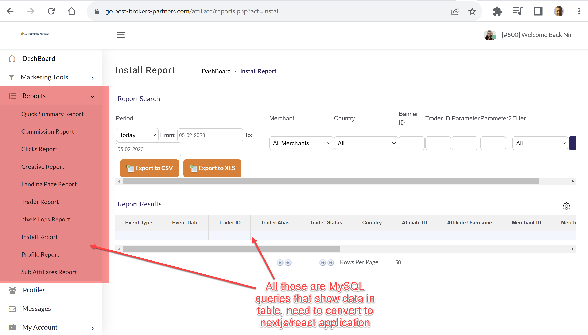
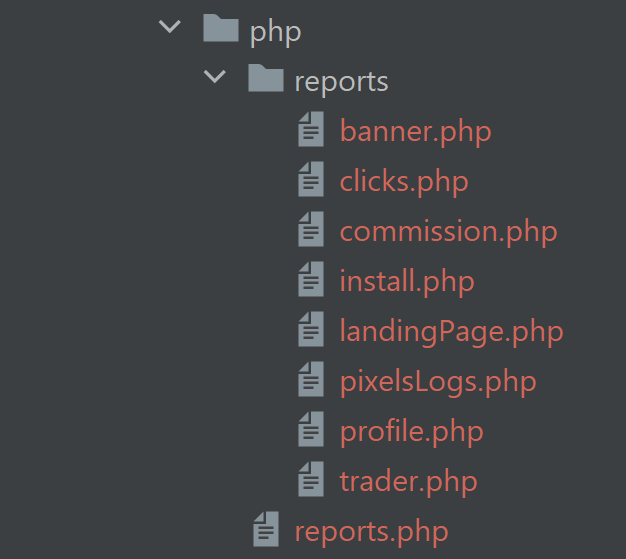

# Convert PHP/MySQL queries to NodeJS/Prisma

## General
We have a legacy MySQL, PHP affiliate management system we want
to convert to modern technology,

this project is to rewrite few PHP/SQL queries as NodeJS/Prisma queries

This project is to convert around 10 to 15 queries

Prisma model already configured and working



### Software stack
- MySQL - Same and shard with  legacy PHP database, cannot change
- NodeJS
- Prisma

### Experience Needed
- PHP - To read existing code
- NodeJS
- MySQL
- Prisma

### Scope

Convert SQL queries from PHP code to prisma

example Prisma code: `app/src/server/api/routers/affiliates/creative.ts`

Also attached

#### PHP

Need to translate queries from PHP code under folder:

`https://github.com/affiliatets-com/FocusOption/tree/main/site/affiliate/reports.php`

Attached



#### New, NextJS

https://github.com/affiliatets-com/aff/tree/main/app

- Prisma definition, already include relationship, may miss some
  `app/prisma/schema.prisma`

- existing prisma call to query MySQL and implement TRPC API
  `app/src/server/api/routers/affiliates`

- React components to show existing screens
  `app/src/components/affiliates`

**Install & Run**

```bash
yarn install
cd app
yarn dev
```

# Access legacy systems

#### PHP 

```
https://go.best-brokers-partners.com/admin/
user: admin
pass: ask
```

once you login to admin, 

select Affiliate->Affiliate List->Search affiliate 500->Login


### Database
to connect to database 

create ./app/.env
ask for the content, include env variable to connect to database
